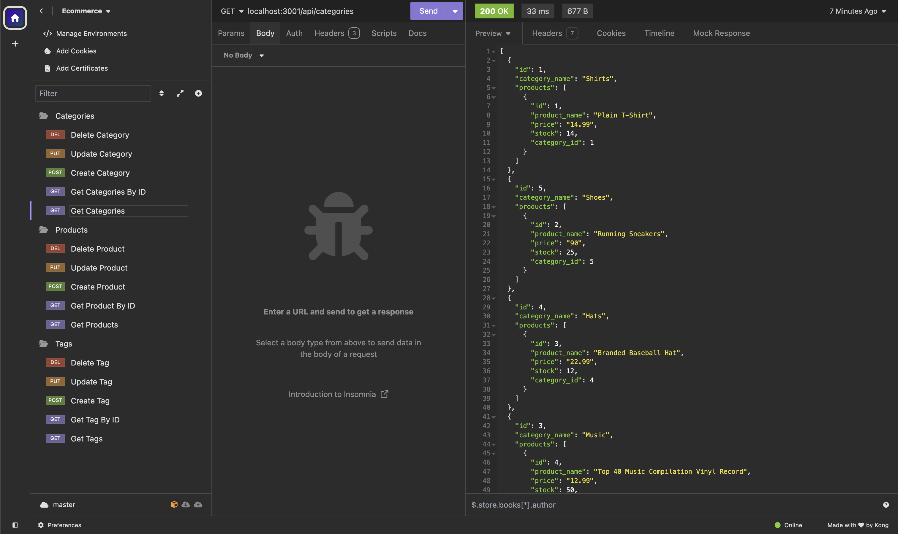

# Employee Payroll Tracker

## Description
This project is to demonstrate my ability to create the backend code for a hypothetical ecommerce
website that requires a database to store their data. This project is for an internet retail company
looking to use the latest technologies in order to compete with its competitors.

## Built with
- Node JS
- Sequelize
- pg ( postgresql database )
- express js
- dotenv package
- psql database

## Links
[Link to Video Demo](https://www.loom.com/share/b10e0e1995f94fe98cea657e6cd12606?sid=b26b0f3f-90d5-409d-b6b9-c4f1847deeca)

## Screenshot
